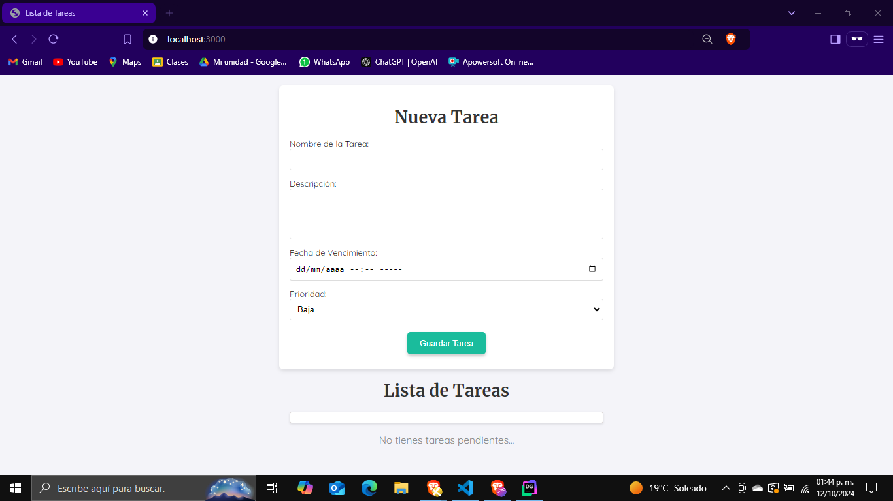
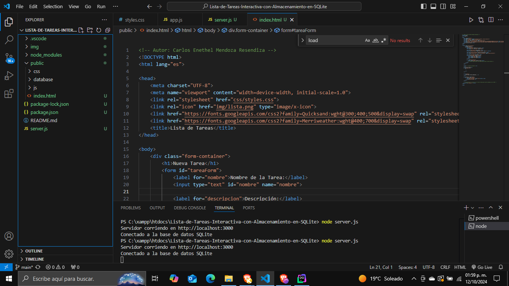
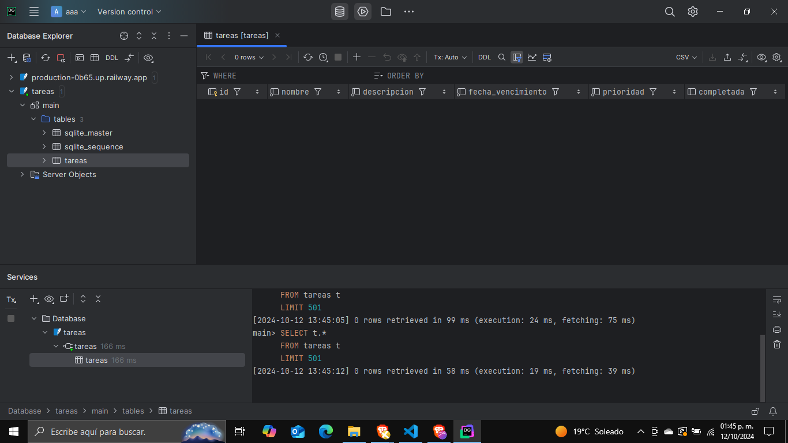
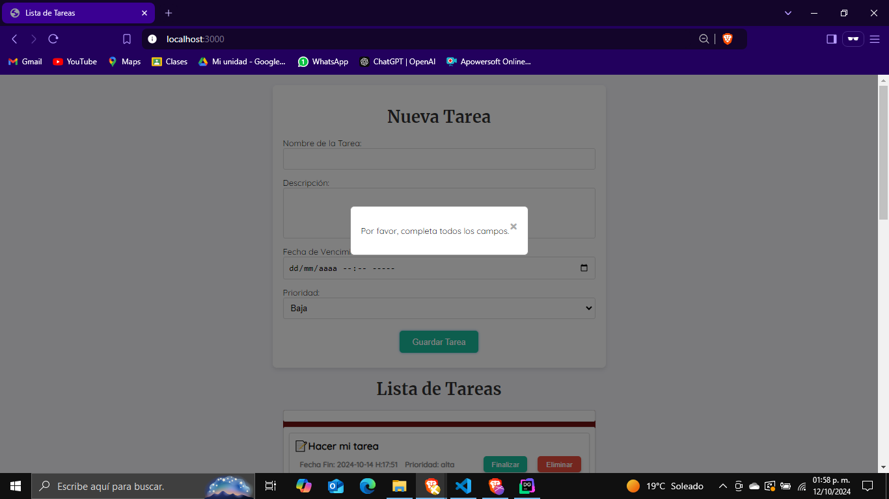
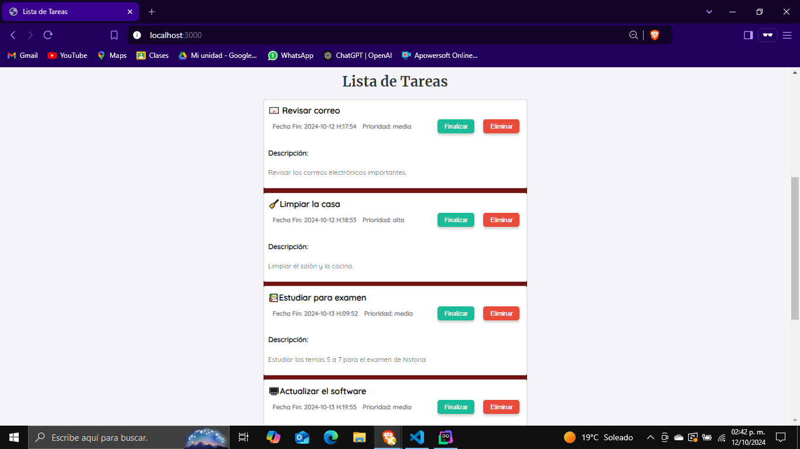
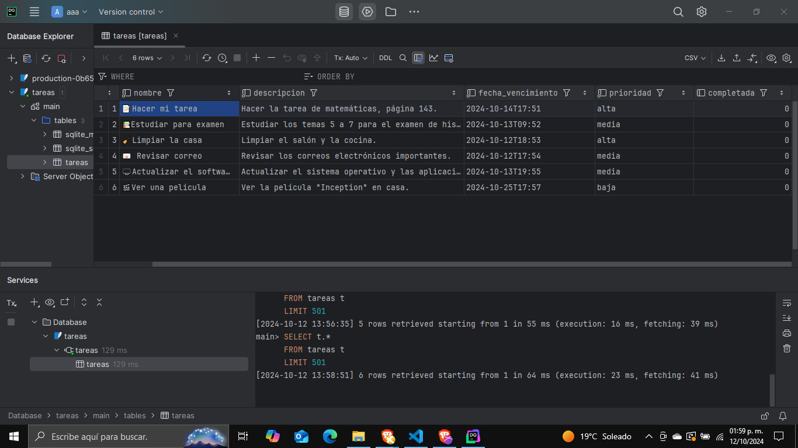
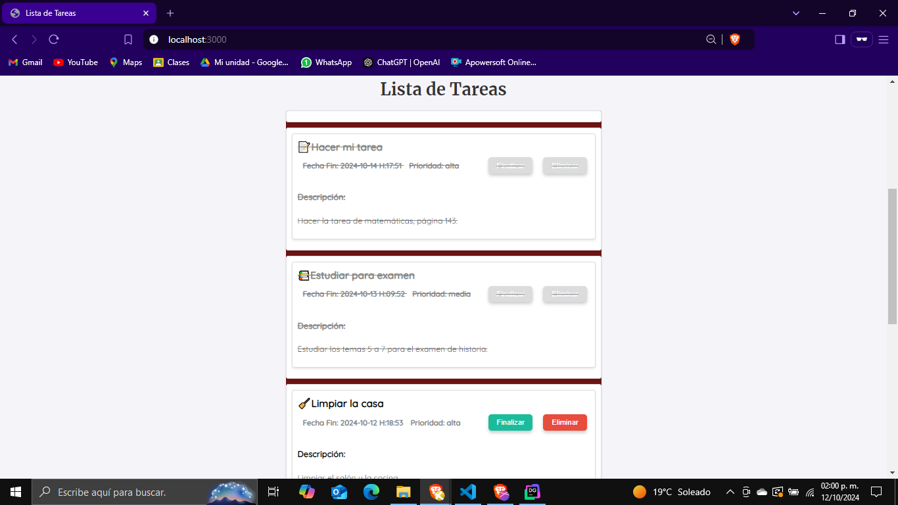
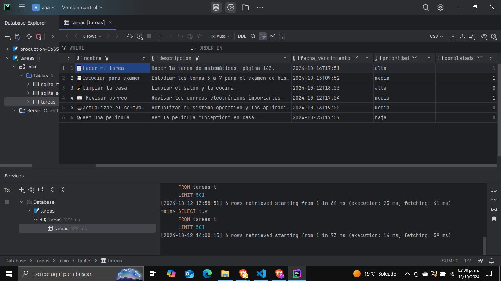

# Lista-de-Tareas-Interactiva-con-Almacenamiento-en-SQLite
Esta aplicación permite gestionar tareas de manera interactiva, con la capacidad de agregar, eliminar, recuperar y marcar tareas como completadas. Utiliza una base de datos SQLite para almacenar de forma persistente la información, asegurando que los datos se mantengan incluso después de cerrar la aplicación.

Instrucciones de Ejecución
	1. Instalar dependencias
		Node.js: Descargar Node.js e instalar.
		SQLite: Descargar SQLite e incluir en la variable de entorno PATH.
	2. Instalar Visual Studio Code
		Descargar Visual Studio Code e instalar.
	3. Clonar el repositorio
		En la terminal, clona el repositorio: https://github.com/Enethel110/Lista-de-Tareas-Interactiva-con-Almacenamiento-en-SQLite.git
		Recuerda tener git intalado.
	4. Instalar dependencias del proyecto
		Abre la carpeta del proyecto con Visual Studio Code:
			code .
		Instala las dependencias:
			npm install
	5. Ejecutar el servidor
		Ejecuta el servidor:
			node server.js
		La aplicación estará disponible en: http://localhost:3000.
	6. Ver la base de datos (opcional)
		Usa un gestor de bases de datos como DataGrip o DB Browser for SQLite para abrir la base de datos tareas.db ubicada en ./public/database/tareas.db.
	
Con estos pasos podrás correr la aplicación localmente y ver las tareas almacenadas en la base de datos.

